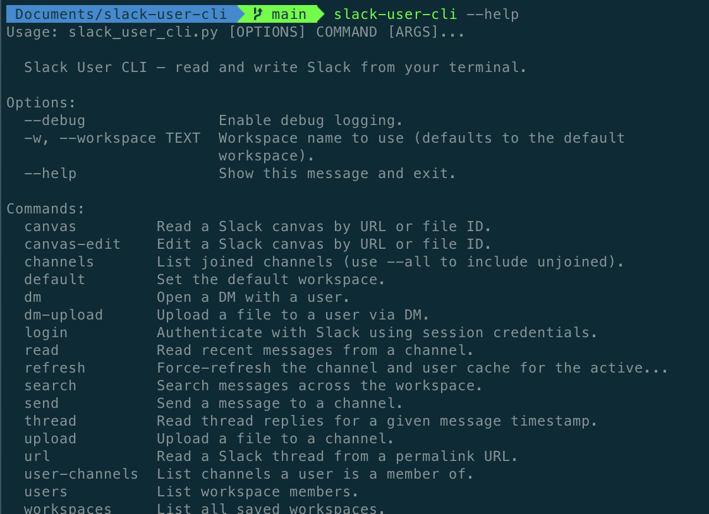

# slack-user-cli

Terminal access to Slack using browser session credentials (`xoxc-` token + `d`
cookie). No Slack app registration, no OAuth flow — it reuses the credentials
already on your machine from the Slack desktop app or browser session.

The tool is exposed both as a standalone CLI and as a
[Claude Code](https://claude.com/claude-code) skill (see
[`SKILL.md`](SKILL.md)).



## Prerequisites

Both install paths require [`uv`](https://docs.astral.sh/uv/) — it's what runs
the script and resolves its Python dependencies on demand. Install it with:

```bash
# macOS / Linux
curl -LsSf https://astral.sh/uv/install.sh | sh

# or via Homebrew
brew install uv
```

The `npx skills` install path additionally requires Node.js (for `npx`).

## Install as a Claude Code skill

Recommended path. Uses [`npx skills`](https://github.com/vercel-labs/skills) to
drop the skill into `~/.claude/skills/slack-user-cli/`:

```bash
npx skills add ClementWalter/slack-user-cli
```

After install, Claude Code picks it up automatically — see
[`SKILL.md`](SKILL.md) for what the skill exposes.

To use it from any directory, put the launcher on `$PATH` — the symlink points at
the checkout, so a `git pull` is all an upgrade takes:

```bash
ln -sfn ~/.claude/skills/slack-user-cli/bin/slack-user ~/.local/bin/slack-user
```

## Install as a standalone CLI

The CLI is a single-file Python script with
[PEP 723](https://peps.python.org/pep-0723/) inline metadata, so
[`uv`](https://docs.astral.sh/uv/) handles dependencies on the fly:

```bash
slack-user --help
```

To use it from any directory, put the launcher on `$PATH` — the symlink points at
the checkout, so a `git pull` is all an upgrade takes:

```bash
ln -sfn /path/to/slack-user-cli/bin/slack-user ~/.local/bin/slack-user
```

## Authentication

Credentials are stored in `~/.config/slack-user-cli/config.json`.

```bash
# Auto-extract from the Slack desktop app (close Slack first; macOS Keychain prompt)
slack_user_cli login --auto

# Import all workspaces from the browser via clipboard
slack_user_cli login --browser

# Add a single workspace manually
slack_user_cli login --manual
```

## Usage

Your first successful `login` automatically becomes the default — every
command uses it unless overridden. If that login imports several workspaces
at once (`--browser`/`--auto`) and you're on a real terminal, you'll be
asked which one should be default; non-interactively, the first one wins.
Logging in to more workspaces later doesn't change the default; switch it
explicitly:

```bash
# Show whose credentials the active workspace uses (own user ID, team ID)
slack_user_cli whoami

# List saved workspaces (marks which one is default)
slack_user_cli workspaces

# Permanently change the default workspace
slack_user_cli default "Workspace Name"

# Override the default for a single command, without changing it
slack_user_cli -w "Other Workspace" channels
```

```bash
# Read
slack_user_cli channels
slack_user_cli read <channel> --limit 20
slack_user_cli read <channel> --limit 20 --json --expand-thread
slack_user_cli thread <channel> <message_ts>
slack_user_cli url "https://workspace.slack.com/archives/C.../p..."
slack_user_cli search "query in:#channel" --count 20

# Download file attachments (PDFs, images, docs) from a message
slack_user_cli download "https://workspace.slack.com/archives/C.../p..." -o ./out
slack_user_cli download <channel> <message_ts> --list

# Write
slack_user_cli send <channel> "message text"
slack_user_cli send <channel> "reply" --thread <message_ts>
slack_user_cli dm <user> "message text"
slack_user_cli upload <channel> /path/to/file.png --message "caption"
```

Every read command emits raw Slack IDs by default (stable for scripting); pass
`--names` to resolve to display names. Every command supports `--json` for
structured output.

See [`SKILL.md`](SKILL.md) for the full command reference, output schemas, and
the channel-summary workflow.

## Cache

Channel and user data is cached at `~/.config/slack-user-cli/cache/<workspace>/`
with a 1-hour TTL. Run `slack_user_cli refresh` to force-rebuild after joining
new channels or when lookups return IDs instead of names.

## Running tests

The test suite is a self-contained `uv` script, same as the CLI itself:

```bash
uv run tests/test_slack_user_cli.py
```

WebClient and `slacktokens` are mocked throughout, so this never touches a
real Slack workspace or the local Slack desktop app.
